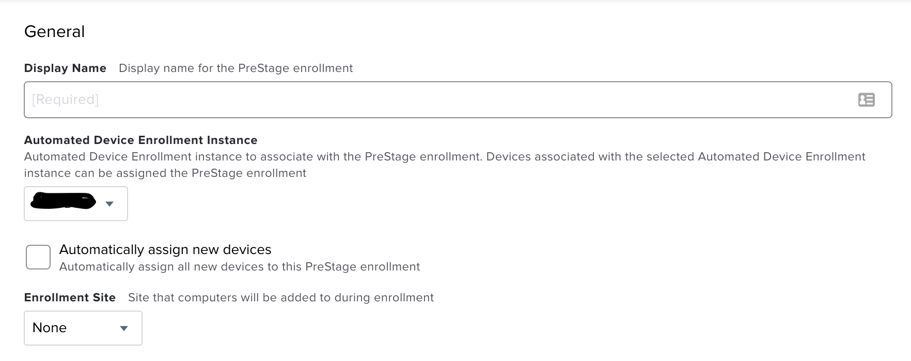

# Enrollment
## Apple School/Business Manager
Make sure Automated Device Enrollment (DEP) is configured. Either use [Apple School Manager](https://school.apple.com) or [Apple Business Manager](https://business.apple.com/). Make sure your reseller ID's and Apple Customer ID's are filled out. This is how the devices get added to your ASM/ABM portal when purchasing them. You also want to add any MDM servers to your instance. Apple's help guide for this can be found [here](https://support.apple.com/guide/apple-school-manager/welcome/web).

# Jamf
## Prestage Enrollments
Once you have your Automated Device Enrollment set up, you can create your first pre stage enrollment in jamf. When Apple devices first boot and check in with Apple's servers they will get pointed to your MDM. In this case it's jamf. If the serial number is in a prestage enrollment the device will follow the setup instructions in the prestage. Items that can be configured are:
- General
- Account Settings
- Configuration Profiles
- User and Location
- Purchasing
- Attachments
- Certificates
- Enrollment Packages

### General
This section contains basic information about the prestage. The name, device source, MDM profile settings, and setup assistant options are all found here.

### Account Settings
The account settings section is where you determine what kind of user account should be created, and if you want an aditional admin account created.

### Configuration Profiles
This section will list all of your configuration profiles. You can check the box to have them be installed during enrollment.

**NOTE:** these profiles will get removed after enrollment if the device isn't in scope.
### User and Location
This is where general user and location settings can be specified. I use this to set the building and department for policy scoping. I'm K-12 so I use department names like "HS Student" and "MS Student" to have policies and profiles easily scoped upon enrollment.

**NOTE:** These settings get applied to all devices in the prestage. You wouldn't want to hard code a username here as all devices would get assigned to that one user.
### Purchasing
This section isn't very useful, in my opinion. You can have this autofill from GSX if you have access.

### Attachments
People Use this?
### Certificates
Again, I don't think there's any reason to use this section. Certificates should be installed with configuration profiles.
### Enrollment Packages
Packages you want to install on enrollment. I personally don't use these. I wouldn't reccomend installing large applications with this. Only nessecery content for enrollment.
